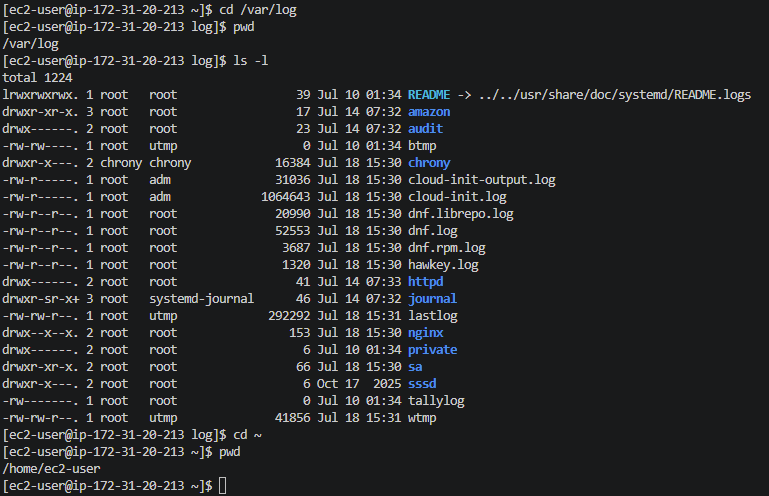
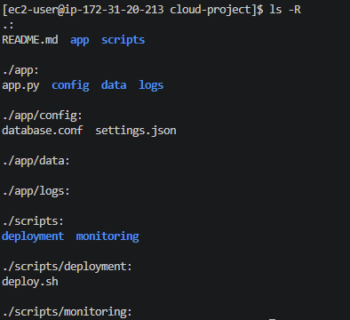
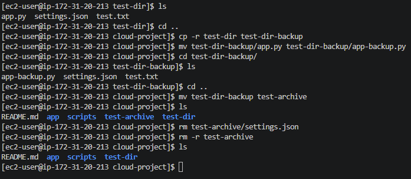
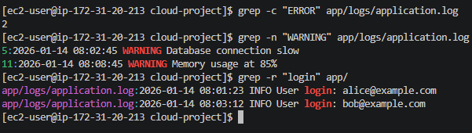
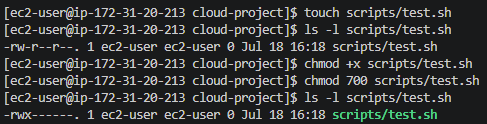
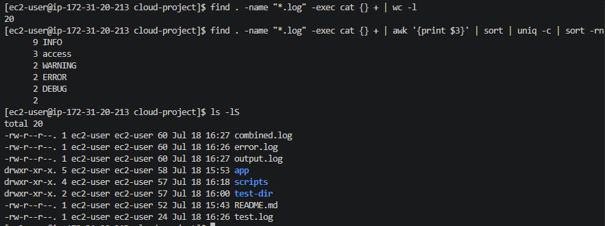
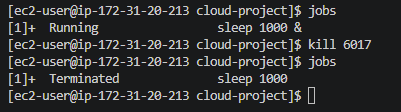
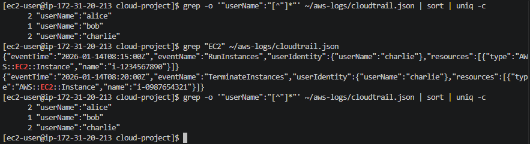
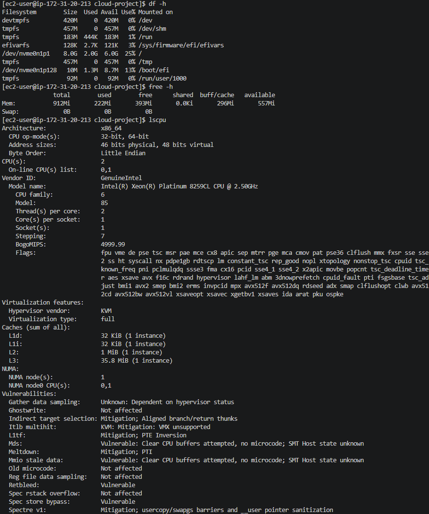

# Lab Solution: Linux Command Line Essentials

**Student Name:** Julio Cesar Aldana Almanza  
**Date:** 07/16/2026  
**Environment Used:** [x] EC2 ☐ Local Linux ☐ WSL ☐ macOS ☐ Cloud9

---

## Part 1: Environment Setup

### Connection Information

**Command used to connect:**
```bash
ssh -i bootcamp-week2-key.pem ec2-user@52.91.129.138
```

**Output of `whoami`:**
```
ec2-user
```

**Output of `pwd`:**
```
/home/ec2-user
```

**Output of `uname -a`:**
```
Linux ip-172-31-20-213.ec2.internal 6.18.36-69.138.amzn2023.x86_64 #2 SMP PREEMPT_DYNAMIC Thu Jul  9 21:06:10 UTC 2026 x86_64 x86_64 x86_64 GNU/Linux
```

---

## Part 2: Navigation Practice

### Task: Navigate to /var/log and back

**Commands executed:**
```bash
# Navigate to /var/log
[ec2-user@ip-172-31-20-213 ~]$ cd /var/log
[ec2-user@ip-172-31-20-213 log]$ pwd
/var/log

# List contents
[ec2-user@ip-172-31-20-213 log]$ ls -l
total 1224
lrwxrwxrwx. 1 root   root                 39 Jul 10 01:34 README -> ../../usr/share/doc/systemd/README.logs
drwxr-xr-x. 3 root   root                 17 Jul 14 07:32 amazon
drwx------. 2 root   root                 23 Jul 14 07:32 audit
-rw-rw----. 1 root   utmp                  0 Jul 10 01:34 btmp
drwxr-x---. 2 chrony chrony            16384 Jul 18 15:30 chrony
-rw-r-----. 1 root   adm               31036 Jul 18 15:30 cloud-init-output.log
-rw-r-----. 1 root   adm             1064643 Jul 18 15:30 cloud-init.log
-rw-r--r--. 1 root   root              20990 Jul 18 15:30 dnf.librepo.log
-rw-r--r--. 1 root   root              52553 Jul 18 15:30 dnf.log
-rw-r--r--. 1 root   root               3687 Jul 18 15:30 dnf.rpm.log
-rw-r--r--. 1 root   root               1320 Jul 18 15:30 hawkey.log
drwx------. 2 root   root                 41 Jul 14 07:33 httpd
drwxr-sr-x+ 3 root   systemd-journal      46 Jul 14 07:32 journal
-rw-rw-r--. 1 root   utmp             292292 Jul 18 15:31 lastlog
drwx--x--x. 2 root   root                153 Jul 18 15:30 nginx
drwx------. 2 root   root                  6 Jul 10 01:34 private
drwxr-xr-x. 2 root   root                 66 Jul 18 15:30 sa
drwxr-x---. 2 root   root                  6 Oct 17  2025 sssd
-rw-------. 1 root   root                  0 Jul 10 01:34 tallylog
-rw-rw-r--. 1 root   utmp              41856 Jul 18 15:31 wtmp

# Return to home directory
[ec2-user@ip-172-31-20-213 log]$ cd ~
[ec2-user@ip-172-31-20-213 ~]$ pwd
/home/ec2-user
```

**Screenshot 1: /var/log directory listing**


---

## Part 3: Directory Structure Creation

### Project Structure

**Commands to create directory structure:**
```bash
# Create cloud-project directory
[ec2-user@ip-172-31-20-213 ~]$ mkdir cloud-project
[ec2-user@ip-172-31-20-213 ~]$ cd cloud-project

# Create nested directories
[ec2-user@ip-172-31-20-213 cloud-project]$ mkdir -p app/config
mkdir -p app/logs
mkdir -p app/data
mkdir -p scripts/deployment
mkdir -p scripts/monitoring
[ec2-user@ip-172-31-20-213 cloud-project]$ ls -R
.:
app  scripts

./app:
config  data  logs

./app/config:

./app/data:

./app/logs:

./scripts:
deployment  monitoring

./scripts/deployment:

./scripts/monitoring:


# Create files
[ec2-user@ip-172-31-20-213 cloud-project]$ touch app/app.py
touch app/config/settings.json
touch app/config/database.conf
touch scripts/deployment/deploy.sh
touch README.md
[ec2-user@ip-172-31-20-213 cloud-project]$ echo "# Cloud Project" > README.md
echo "This is a sample cloud application." >> README.md
[ec2-user@ip-172-31-20-213 cloud-project]$ cat > app/app.py << 'EOF'
#!/usr/bin/env python3
# Simple cloud application
print("Hello from the cloud!")
EOF


```

**Screenshot 2: Project structure (tree or ls -R output)**


---

## Part 4: File Operations

### Copy, Move, Delete Practice

**Commands for test directory task:**
```bash
# Create test directory with files
[ec2-user@ip-172-31-20-213 cloud-project]$ mkdir test-dir
[ec2-user@ip-172-31-20-213 test-dir]$ ls
app.py  settings.json  test.txt

# Make backup copy
[ec2-user@ip-172-31-20-213 cloud-project]$ cp -r test-dir test-dir-backup

# Rename backup
[ec2-user@ip-172-31-20-213 cloud-project]$ mv test-dir-backup/app.py test-dir-backup/app-backup.py
[ec2-user@ip-172-31-20-213 cloud-project]$ cd test-dir-backup/
[ec2-user@ip-172-31-20-213 test-dir-backup]$ ls
app-backup.py  settings.json  test.txt
[ec2-user@ip-172-31-20-213 test-dir-backup]$ cd ..
[ec2-user@ip-172-31-20-213 cloud-project]$ mv test-dir-backup test-archive
[ec2-user@ip-172-31-20-213 cloud-project]$ ls
README.md  app  scripts  test-archive  test-dir

# Delete backup
[ec2-user@ip-172-31-20-213 cloud-project]$ rm test-archive/settings.json
[ec2-user@ip-172-31-20-213 cloud-project]$ rm -r test-archive


# Verify final state
[ec2-user@ip-172-31-20-213 cloud-project]$ ls
README.md  app  scripts  test-dir
```

**Screenshot 3: File operations results**


---

## Part 5: Viewing File Contents

### Log File Analysis

**Output of last 3 lines:**
```
2026-01-14 08:15:30 INFO Backup completed successfully
2026-01-14 08:20:00 DEBUG Garbage collection triggered
2026-01-14 08:25:15 INFO Health check: OK
```

**Command used:**
```bash
[ec2-user@ip-172-31-20-213 cloud-project]$ tail -n 3 app/logs/application.log
```

---

## Part 6: Searching with grep

### Task: Search log file

**1. Count ERROR messages:**
```bash
# Command:
grep -c "ERROR" app/logs/application.log
# Output:
2
```

**2. Find WARNING messages with line numbers:**
```bash
# Command:
grep -n "WARNING" app/logs/application.log
# Output:
5:2026-01-14 08:02:45 WARNING Database connection slow
11:2026-01-14 08:08:45 WARNING Memory usage at 85%
```

**3. Extract user login events:**
```bash
# Command:
 grep -r "login" app/
# Output:
app/logs/application.log:2026-01-14 08:01:23 INFO User login: alice@example.com
app/logs/application.log:2026-01-14 08:03:12 INFO User login: bob@example.com
```

**Screenshot 4: grep search results**


---

## Part 7: File Permissions

### Task: Create and secure script

**Commands executed:**
```bash
# Create test script
[ec2-user@ip-172-31-20-213 cloud-project]$ touch scripts/test.sh

# Check initial permissions
[ec2-user@ip-172-31-20-213 cloud-project]$ ls -l scripts/test.sh
-rw-r--r--. 1 ec2-user ec2-user 0 Jul 18 16:18 scripts/test.sh

# Make executable for owner only
[ec2-user@ip-172-31-20-213 cloud-project]$ chmod +x scripts/test.sh
[ec2-user@ip-172-31-20-213 cloud-project]$ chmod 740 scripts/test.sh

# Verify permissions
[ec2-user@ip-172-31-20-213 cloud-project]$ ls -l scripts/test.sh
-rwx------. 1 ec2-user ec2-user 0 Jul 18 16:18 scripts/test.sh
```

**Initial permissions:** -rw-r--r--

**Final permissions:** -rwx------

**Screenshot 5: Permission changes**


### Secure Backup Script

**Script content:**
```bash
#!/bin/bash
echo "Deploying application..."
# Deployment logic here
```

**Permissions set:**
```bash
# Command:
chmod 750 scripts/deployment/deploy.sh
# Result (ls -l):
-rwxr-x---. 1 ec2-user ec2-user 68 Jul 18 16:24 scripts/deployment/deploy.sh
```

---

## Part 8: Pipes and Redirects

### Task: Command chaining

**1. Count total lines in all .log files:**
```bash
# Command:
find . -name "*.log" -exec cat {} + | wc -l
# Result:
20
```

**2. Find unique log levels and count:**
```bash
# Command:
find . -name "*.log" -exec cat {} + | awk '{print $3}' | sort | uniq -c | sort -rn
# Result:
      9 INFO
      3 access
      2 WARNING
      2 ERROR
      2 DEBUG 
```

**3. List files sorted by size:**
```bash
# Command:
ls -lS
# Result:
total 20
-rw-r--r--. 1 ec2-user ec2-user 60 Jul 18 16:27 combined.log
-rw-r--r--. 1 ec2-user ec2-user 60 Jul 18 16:26 error.log
-rw-r--r--. 1 ec2-user ec2-user 60 Jul 18 16:27 output.log
drwxr-xr-x. 5 ec2-user ec2-user 58 Jul 18 15:53 app
drwxr-xr-x. 4 ec2-user ec2-user 57 Jul 18 16:18 scripts
drwxr-xr-x. 2 ec2-user ec2-user 57 Jul 18 16:00 test-dir
-rw-r--r--. 1 ec2-user ec2-user 52 Jul 18 15:43 README.md
-rw-r--r--. 1 ec2-user ec2-user 24 Jul 18 16:26 test.log
```

**Screenshot 6: Pipes and redirects output**


---

## Part 9: Process Management

### Task: Background process

**1. Start long-running command in background:**
```bash
# Command:
sleep 1000 &
# Output (job number):
[1] 6017
```

**2. List all jobs:**
```bash
# Command:
jobs
# Output:
[1]+  Running                 sleep 1000 &
```

**3. Kill the process:**
```bash
# Command:
kill 6017
# Verification:
[ec2-user@ip-172-31-20-213 cloud-project]$ jobs
[1]+  Terminated              sleep 1000
```

**Screenshot 7: Process management**


---

## Part 10: Cloud Engineering Scenarios

### CloudTrail Log Analysis

**1. Events per user:**
```bash
# Command:
grep -o '"userName":"[^"]*"' ~/aws-logs/cloudtrail.json | sort | uniq -c
# Result:
	  2 "userName":"alice"
      1 "userName":"bob"
      2 "userName":"charlie"
```

**2. EC2 operations:**
```bash
# Command:
grep "EC2" ~/aws-logs/cloudtrail.json
# Result:
{"eventTime":"2026-01-14T08:15:00Z","eventName":"RunInstances","userIdentity":{"userName":"charlie"},"resources":[{"type":"AWS::EC2::Instance","name":"i-1234567890"}]}
{"eventTime":"2026-01-14T08:20:00Z","eventName":"TerminateInstances","userIdentity":{"userName":"charlie"},"resources":[{"type":"AWS::EC2::Instance","name":"i-0987654321"}]}
```

**3. Unique event types:**
```bash
# Command:
grep -o '"eventName":"[^"]*"' ~/aws-logs/cloudtrail.json | cut -d'"' -f4 | sort | uniq
# Result:
CreateBucket
DeleteBucket
PutObject
RunInstances
TerminateInstances
```

**Screenshot 8: CloudTrail analysis**


### System Monitoring

**1. Disk space:**
```bash
# Command: df -h

# Total space: 8.0G 
# Used: 2.0G
# Available: 6.0G
# Usage %: 25%
```

**2. Available memory:**
```bash
# Command: free -h

# Total: 912Mi
# Used: 212Mi
# Free: 403Mi
```

**3. CPU cores:**
```bash
# Command: lscpu

# CPU(s): 2
# Model: Intel(R) Xeon(R) Platinum 8259CL CPU @ 2.50GHz
```

**Screenshot 9: System resources**


---

## Command Cheat Sheet (Your Most Used)

**List your 10 most-used commands from this lab:**

1. cd 
2. mkdir
3. ls -l
4. chmod permissions file
5. cat
6. grep
7. touch
8. tail
9. ps
10. top

---

## Reflection Questions

### 1. How do file permissions enhance security in cloud environments?

**Your answer:**
```
They restrict the edition or access of sensitive files to avoid unexpected changes. 
```

### 2. Why is piping commands together more efficient than intermediate files?

**Your answer:**
```
You can run a process that requires more than one command in a single line, 
which automate the file management in a certain way. 
```

### 3. Describe a real-world scenario where you'd use `tail -f`.

**Your answer:**
```
When you want to monitor the execution of an application in real-time (ideal for testing)
```

### 4. What's the difference between killing with `kill` vs `kill -9`?

**Your answer:**
```
kill -9 forces the system to terminate a process. 
```

### 5. How does Linux CLI proficiency help with AWS CLI usage?

**Your answer:**
```
Management of projects using command line instructions help the user to automate processes,
creation of scripts to run them is possible with CLI. 
```

---

## Troubleshooting Log

**Did you encounter any issues?** (Yes/No): No

**If yes, document:**

| Issue | Commands Tried | Solution | Time Spent |
|-------|---------------|----------|------------|
|       |               |          |            |
|       |               |          |            |
|       |               |          |            |

---

## Cleanup Confirmation

- [x] Removed ~/cloud-project directory
- [x] Removed ~/aws-logs directory
- [x] Verified no leftover files

**Cleanup commands:**
```bash
rm -r cloud-project
rm -r aws-logs
```

---

## Self-Assessment

**Rate your confidence (1-5, where 5 is expert):**

| Skill | Before Lab | After Lab | Notes |
|-------|-----------|-----------|-------|
| Filesystem navigation | 4/5 | 5/5 | |
| File manipulation | 2/5 | 5/5 | |
| Viewing/searching files | 1/5 | 5/5 | |
| File permissions | 1/5 | 5/5 | |
| Pipes and redirects | 1/5 | 4/5 | |
| Process management | 2/5 | 4/5 | |
| Log analysis | 1/5 | 4/5 | |

---

## Bonus Challenges Completed

- [ ] Explored `awk` for text processing
- [ ] Created a shell script with multiple commands
- [ ] Used `find` with complex criteria
- [ ] Practiced `sed` for text replacement
- [ ] Set up custom bash aliases

**Bonus notes:**
```
_____________________________________________________________
_____________________________________________________________
_____________________________________________________________
```

---

## Instructor Verification

**Instructor Name:** ___________________________

**Date Reviewed:** ___________________________

**All tasks completed:** ☐ Yes ☐ No

**Comments:**
```
_____________________________________________________________
_____________________________________________________________
_____________________________________________________________
```

**Grade/Status:** ___________________________

---

**Lab Status:** ☐ Complete ☐ Needs Revision

**Total Time Spent:** 80 minutes

**Submission Date:** 07/18/2026
